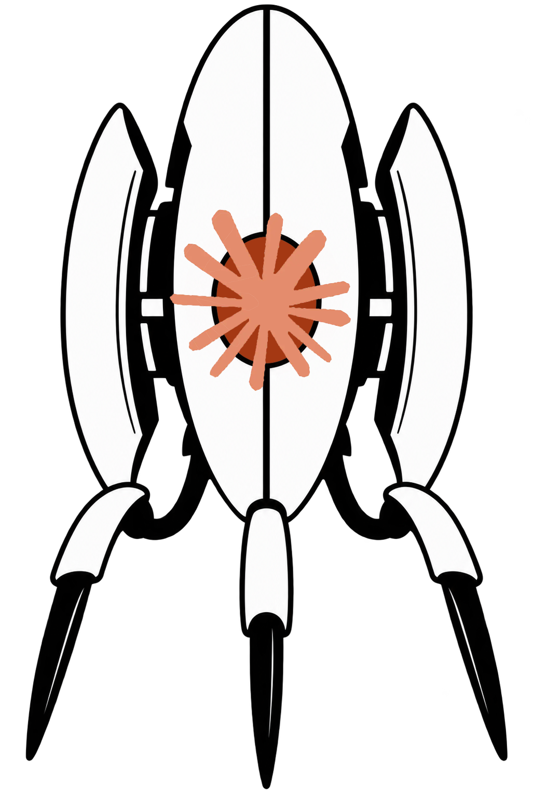

# TalkingTurret

<p align="center">
  
</p>

A plugin that gives claude code a soul. Makes claude accompany its response with voice-sample from the portal games. Also works great as an audible notification when claude is waiting on new input.

The voice lines feature mainly portal's turrets, with some GLaDOS sprinkled in occasionally, sourced from [the Portal Wiki's Voice lines page](https://theportalwiki.com/wiki/Voice_lines).

## Installation

**Prerequisites:** [Claude Code](https://claude.com/claude-code) itself (which bundles Node.js, used to run the hook scripts) and `git`. No npm packages, no build step.

```bash
git clone https://github.com/IseTheHuman/TalkingTurret.git ~/.claude/skills/talking-turret
```

That's it — Claude Code auto-discovers any plugin placed under `~/.claude/skills/<name>/` (containing a `.claude-plugin/plugin.json`) with no separate `/plugin install` step. **Restart Claude Code (start a new session)** for it to take effect — plugins are only loaded at session start, so an already-running session won't pick it up.

Verify it's loaded:

```bash
claude plugin list
```

You should see `talking-turret@skills-dir` listed under "Skills-directory plugins" with status `loaded`.

**If you already have your own personal sound hooks** wired up directly in `~/.claude/settings.json` (rather than through this plugin), remove those entries first — otherwise every event fires twice, once from each source.

**To update:** `git pull` inside `~/.claude/skills/talking-turret`, then restart.

**To uninstall:** delete the `~/.claude/skills/talking-turret` folder, then restart.

## Compatibility

| Setup | Works? | Notes |
|---|---|---|
| Windows 10/11 | ✅ Yes | Uses `System.Media.SoundPlayer` via PowerShell (built into every supported Windows version). |
| macOS | ✅ Yes | Uses `afplay` (built-in, no install needed). |
| Linux desktop (Ubuntu, Fedora, etc.) | ✅ Usually | Uses whichever of `paplay`, `aplay`, or `ffplay` is found on `PATH`, in that order. Most desktop distros ship at least one out of the box. |
| Linux minimal/server distro with no audio player installed | ⚠️ Silent no-op | The hook runs, logs the pick, but plays nothing — by design, so a missing player never errors or blocks a turn. Install `pulseaudio-utils` (`paplay`) or `alsa-utils` (`aplay`) to fix. |
| **Remote/SSH sessions, cloud VMs, devcontainers, CI runners, Codespaces** | ❌ No (by design of how hooks work) | A hook's shell command runs wherever the **Claude Code process** runs — on a remote machine, that's the remote machine, not your local speakers. There's no built-in audio relay back to your local device. If you're SSH'd into a headless server, you will not hear anything, even if the plugin loads and "works" correctly on that end. |
| WSL (Windows Subsystem for Linux) | ⚠️ Depends | Needs WSLg's audio passthrough (Windows 11, enabled by default in recent versions) or manually configured PulseAudio-over-network forwarding to reach your Windows speakers. Not guaranteed out of the box on older WSL setups. |
| Multiple concurrent Claude Code sessions on one machine | ⚠️ Works, but sounds are unattributed | All sessions share the same system audio output — you can't tell which session made a given sound just by ear. `${CLAUDE_PLUGIN_DATA}/hook-fire-log.jsonl` records the session ID per firing if you need to check after the fact. |
| Claude Code on the web (claude.ai/code, cloud-hosted) | ❌ No | Runs in a cloud sandbox, not your machine, so same problem as the Remote/SSH row - plus cloud sessions load hooks from the repo and org-managed settings rather than your local `~/.claude/skills/`, so a personally-installed plugin like this one likely won't even load there in the first place. |
| Remote Control (claude.ai/code or the Claude mobile app, controlling a session on your computer) | ✅ Yes, but plays on the controlled machine | Code execution stays local to the computer running the session, so hooks/audio work exactly as if you were sitting at it - the sound plays on *that machine's* speakers, not your phone or browser. Controlling a desktop session from your phone across the room won't get the sound to your phone. |
